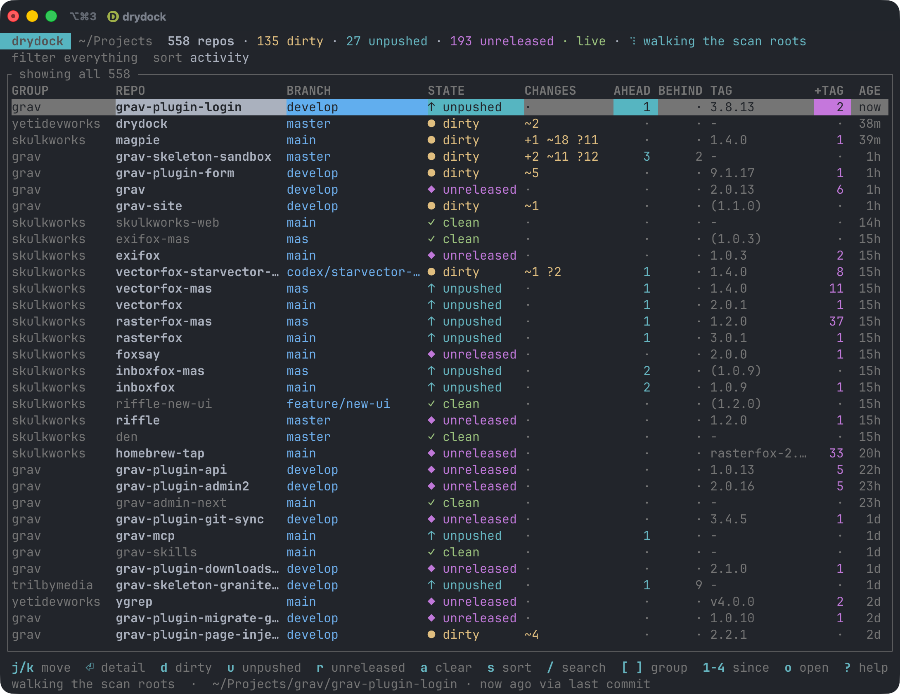

# drydock

```
     _                _            _
  __| |_ __ _   _  __| | ___   ___| | __
 / _` | '__| | | |/ _` |/ _ \ / __| |/ /
| (_| | |  | |_| | (_| | (_) | (__|   <
 \__,_|_|   \__, |\__,_|\___/ \___|_|\_\
            |___/   what's still in for work.
```

**What's uncommitted, unpushed, and unreleased across every repo you own.**

A drydock is where vessels sit while work is done on them, before they go back
out. If you keep dozens or hundreds of checkouts on disk and lose track of which
ones still have work sitting in them, this tells you, in one screen, live.

Written in Rust. Works on macOS and Linux.



Colour carries the state, so the rows worth acting on stand out without reading
a word: yellow for uncommitted changes, cyan for commits you haven't pushed,
magenta for commits past the last tag, red for conflicts and half-finished
merges, and everything clean dimmed out of the way.

## What it answers

- **What did I touch recently?** Filter to the last hour, day, week or month.
  A clean repo's activity is its newest commit; a dirty repo's is when you last
  saved a changed file, which is usually much more recent.
- **What have I not committed?** Staged, unstaged, untracked and conflicted
  counts per repo, plus stashes and any half-finished merge or rebase.
- **What have I not pushed?** Across *every* local branch, not just the one
  that happens to be checked out. Side branches are exactly where work goes
  missing.
- **What's worth releasing?** Every repo sits in one of three release states,
  in their own column:

  | | |
  |---|---|
  | `· unreleased` | no tags at all, never been released |
  | `✓ released` | tagged, with nothing since |
  | `◆ needs release` | tagged, but with commits or uncommitted changes past the tag |

  Plus the commits since the last tag with their actual subjects, and whether
  `CHANGELOG.md` has run ahead of the newest tag.

  Release state is a separate axis from working state: a repo can be dirty and
  released, or spotless and still needing a release.

## Install

**Homebrew**

```sh
brew install yetidevworks/drydock/drydock
```

**Cargo**

```sh
cargo install drydock
```

**From source**

```sh
git clone https://github.com/yetidevworks/drydock
cd drydock
make install          # into ~/.local/bin
```

## Use

Run it with no arguments for the live dashboard:

```sh
drydock
```

It scans the directories in your config (`~/Projects` by default), *not* the
current directory, so it behaves the same wherever you invoke it.

### Dashboard keys

| | |
|---|---|
| `j` `k` `↑` `↓` | move · `ctrl-d` / `ctrl-u` half a page · `home` / `end` ends |
| mouse | click a row to select it · wheel moves the selection |
| `⏎` | detail view: branches, commits since the last tag, changed files |
| `d` `u` `b` | filter to dirty, unpushed, behind |
| `r` `N` | filter to needs-release, never-released |
| `c` `i` `x` `e` | conflicts, operation in progress, detached HEAD, probe errors |
| `n` | only repos with nothing outstanding |
| `&` | switch between matching **any** active filter and **all** of them |
| `a` | clear every filter |
| `/` | fuzzy search on name, group and branch |
| `[` `]` | step through groups |
| `1` `2` `3` `4` | touched in the last hour, day, week, month · `0` any age |
| `s` `S` | cycle the sort key · reverse it |
| `o` `t` `T` | open in your editor, git client, or a terminal |
| `w` `y` | open the remote in a browser · copy the path |
| `f` `F` | fetch the selected repo · everything on screen |
| `C` | choose which columns to show |
| `R` | rescan now · `?` help · `q` quit |

### Commands

```sh
drydock list --dirty --since 1d              # a table, then exit
drydock list --unpushed --group acme --json  # machine-readable
drydock list --cached                        # last known state, no probing (~5ms)
drydock releasable --min-commits 3           # what's worth a release pass
drydock status .                             # everything about one repo
drydock scan                                 # refresh the cache
drydock groups                               # per-group tallies
drydock config init                          # write a config file
```

Every command takes `--json`, so `drydock list --cached --json` is cheap enough
to drive a status line.

### Filters

`--dirty` `--unpushed` `--behind` `--conflicted` `--in-progress` `--detached`
`--no-remote` `--no-upstream` `--stashed` `--clean` `--errored`

Release state: `--unreleased` (never tagged), `--needs-release`, `--released`.

Several filters **widen** the result by default: `--dirty --unpushed` means
"either". Pass `--match all` (or press `&`) to require all of them instead.

## How it works, and why it's quick

Measured on a real tree of ~550 repos, on an Apple silicon Mac:

| | |
|---|---|
| Walk the tree | ~0.9s |
| Refs, tags, tracking (tier 1) | ~1.4s |
| Full sweep, working trees from cache | **~2.2s** |
| Full sweep, cold | ~6.2s |
| `list --cached` | ~5ms |
| Watcher startup | ~19ms |

The split is the whole design. Reading refs and tags is cheap. Scanning working
trees is not: `git status` across that many repos costs around 40 seconds of
syscall time, roughly 85% of the total. So:

- **Tier 1** — refs, tags, tracking counts, stash count, in-progress operations
  — runs on every sweep.
- **Tier 2** — the working-tree scan — is cached against HEAD and the index
  mtime, and only reruns where something actually moved.
- A **filesystem watcher** then re-probes individual repos as they change, which
  costs milliseconds. That is what makes leaving the dashboard open all day
  reasonable rather than a background CPU tax.

Some implementation notes worth knowing:

- It **shells out to `git`** rather than linking a git library, so the numbers
  match exactly what you see on the command line, including whatever per-repo
  config is in play. Process startup is noise next to the scan it wraps.
- Every invocation passes **`--no-optional-locks`**. Without it, polling hundreds
  of repos would take `index.lock` and rewrite indexes constantly, fighting your
  editor and any GUI client you have open.
- The index mtime is deliberately **not** treated as activity. Any tool that runs
  `git status` refreshes it, so an editor sitting open on a repo would otherwise
  make it read as recently active when nothing had happened.
- **Git-flow back-merges are not counted** as work to release. After a release,
  `develop` carries a "Merge tag 'x.y.z' into develop" commit the tag cannot
  reach; counting it reported one commit to release when there was none. Merge
  commits are excluded, unless a merge is the only thing there and it genuinely
  changes the tree.
- Discovery **stops descending the moment it finds a repo**, which keeps
  submodules and vendored checkouts out of the list without enumerating them.

### Ahead, behind, and the network

Ahead and behind counts come from remote-tracking refs you have **already
fetched**, so no network access is involved and they are safe to recompute
constantly. That also means **"behind" is only as fresh as your last fetch**.

Fetching is off by default, because it is real traffic against every remote you
own and a remote that wants credentials can hang. Press `f` to fetch the
selected repo, `F` for everything on screen, or set `remote.fetch = true` to
have it happen on a timer.

### Worktrees

A bare repo with its worktrees beside it — `.git/` next to `trunk/` and
`branch/` — is listed as you'd expect: each worktree is a repo in its own
right, grouped under the bare repo's name, and the bare repo itself gets a
`bare` state rather than being scanned for a working tree it doesn't have.

This works with `follow_nested_repos` left off. That setting exists to keep
submodules and vendored checkouts from being listed separately from the repo
containing them, and a bare repo has no working tree for anything to be
contained *in* — so it's descended into regardless. A checkout genuinely
nested inside a working tree is still pruned.

### Visibility

The VISIBILITY column shows whether each repo is public, private, or (on
GitHub Enterprise) internal. This isn't a `git` concept — nothing under
`.git` records it — so it's the one column that asks the *hosting provider*
directly, rather than reading anything local. Right now the only provider
supported is GitHub, via [`gh`](https://cli.github.com). (GitLab is the
natural next provider to add, since `glab` mirrors `gh` closely; Bitbucket
has no equivalent first-party CLI, so supporting it would mean handling API
tokens directly rather than riding on a CLI you've already authenticated.)

It's off by default (`visibility.enabled = false`), for the same reason
fetching is: it's real API traffic, and it depends on `gh` being installed
and already authenticated (`gh auth status`). Set `visibility.enabled = true`
to turn it on — the column appears with it, since a VISIBILITY column with
checking off would just read "checking off" on every row while still costing
the width. A checked value is cached and trusted for `visibility.interval`
(a day, by default — visibility changes rarely) so repeat runs stay cheap.
Filter with `--public` or `--private` on `list`.

Every non-value in this column says specifically why, rather than a bare `-`:

| Cell | Meaning |
|---|---|
| `no remote configured` | Nothing to ever check. Free to know, shown even with checking off. |
| `unsupported` | The remote is on a host nothing recognises. Also free. |
| `checking disabled` | The remote *is* checkable, but `visibility.enabled` is off. Shown in the table as `not checked`. |
| `unknown` | The repo itself couldn't be read, so whether it even has a remote isn't established. |
| `check failed` | A check was attempted and failed (rate limited, not authenticated, timed out), with nothing cached to fall back to. The actual reason is never shown in a table — one long message would widen the column for every row — but it's always available via `status <repo>` or `--json` (`visibility_error`).|

A GitHub wiki's clone URL (`<repo>.wiki.git`) isn't a repository the API can
look up on its own, so it's resolved to its parent repo instead: a wiki's
VISIBILITY cell shows the parent repo's actual visibility, not
`unsupported`.

Markers, so the column scans without reading the words: `●` public, `⊘`
private, `◐` internal, `!` a check that was attempted and failed, `·` a cell
with no answer for one of the reasons above. Public is green and private is
blue — private isn't a warning state, it's the one most repos should be in —
and grey is kept for the cells that hold no answer at all.

If you know the markers the words are redundant, so there's a **`VIS`**
column that's just the marker. It's four characters instead of fifteen, which
at 120 columns is the difference between `drydock` and `dryd…` in the repo
name. Pick it in the `C` picker, or use `"visibility_short"` in `[ui]
columns`. The two forms are the same value, so asking for both gives you
whichever you listed first.

Remote URLs are parsed rather than prefix-matched, so the awkward-but-real
shapes are recognised too: `ssh.github.com` on port 443 (what you end up with
on a network that blocks 22), an explicit port, `git://`, credentials in an
https URL, a trailing slash. A web URL deeper than `owner/repo` is rejected
rather than guessed at.

### Columns

Press `C` in the dashboard to choose which columns to show. Space toggles the
one under the cursor, `J` and `K` move it left and right, `a` goes back to the
defaults, and `esc` saves. The table behind the panel redraws as you go, so
you can see what each change costs before committing to it. Only REPO can't be
turned off.

Closing the panel writes the list to `[ui] columns` in your config, which the
plain `drydock list` table reads too:

```toml
[ui]
columns = ["group", "repo", "branch", "state", "changes", "age"]
```

Leave it unset and you get the defaults, which are every column except
VISIBILITY, and VISIBILITY as well when `visibility.enabled` is on. Set it and
you get exactly what you list, in the order you list it.

Turning VISIBILITY on in the picker turns `visibility.enabled` on with it and
kicks off a sweep — otherwise the column could only ever say "checking off".
Turning it back off leaves checking on, since `--public`, `--private` and
`--json` still read it; set `visibility.enabled = false` yourself to stop the
API traffic.

## Configuration

`drydock config init` writes the defaults to
`~/Library/Application Support/drydock/config.toml` on macOS, or
`~/.config/drydock/config.toml` on Linux. The cache lives under
`~/Library/Caches/drydock` or `~/.cache/drydock`. `drydock config path`
prints both, whatever they resolved to.

If you keep every tool's config in `~/.config` and sync it between machines,
you can have that on macOS too. Either set `XDG_CONFIG_HOME` (and
`XDG_CACHE_HOME`) explicitly, or just create `~/.config/drydock` — drydock
uses it if it's already there. Neither moves an existing config, so doing
nothing keeps the platform default.

```toml
roots = ["~/Projects"]       # each immediate subdirectory becomes a "group"
max_depth = 4
follow_nested_repos = false  # keeps submodules and vendored checkouts out
                             # (bare repos always descend — see "Worktrees")
follow_symlinks = false      # so a symlinked tree can't be counted twice
exclude = ["fixtures/**"]    # globs, relative to a root
prune = []                   # extra directory names to skip

[refresh]
interval = "5m"              # backstop sweep; the watcher handles the rest
watch = true
debounce = "1s"

[status]
untracked = "normal"         # normal | all | no
concurrency = 12             # omit to size from your core count
max_files = 200

[release]
# Requires a digit, so marker tags like `latest` aren't mistaken for releases.
tag_pattern = "*[0-9]*"
read_changelog = true

[remote]
fetch = false                # see "Ahead, behind, and the network"
interval = "1h"

[visibility]
enabled = false               # see "Visibility"; requires `gh`
interval = "24h"

[ui]
# columns = [...]            # unset = the defaults; the `C` key writes this
default_filters = []         # e.g. ["dirty", "unpushed"]
default_sort = "activity"
default_since = ""           # e.g. "1w"
editor_command = ["zed", "{path}"]
git_client_command = ["open", "-a", "Tower", "{path}"]
```

`drydock config show` prints the effective config; `drydock config path` says
where things live.

### Tags, and a note on git-flow

With git-flow, tags land on `master` while work carries on on `develop`, so the
newest tag by date often isn't an ancestor of `HEAD`. drydock reports the nearest
**reachable** tag as the primary number and flags the discrepancy rather than
quietly picking one.

A tag shown in parentheses, like `(1.9.4)`, means the newest tag isn't reachable
from the current branch. The `+TAG` column always counts commits since the
reachable tag.

## Development

```sh
make check        # fmt, clippy with -D warnings, and tests
cargo test
cargo test -- --ignored    # plus the slow watcher-startup regression test
```

`drydock tui-snapshot --width 150 --height 40 --view help` renders one dashboard
frame to plain text, which is how the layout gets reviewed without a terminal.
Views: `none`, `filtered`, `detail`, `help`, `search`, `scanning`.

## Licence

MIT
